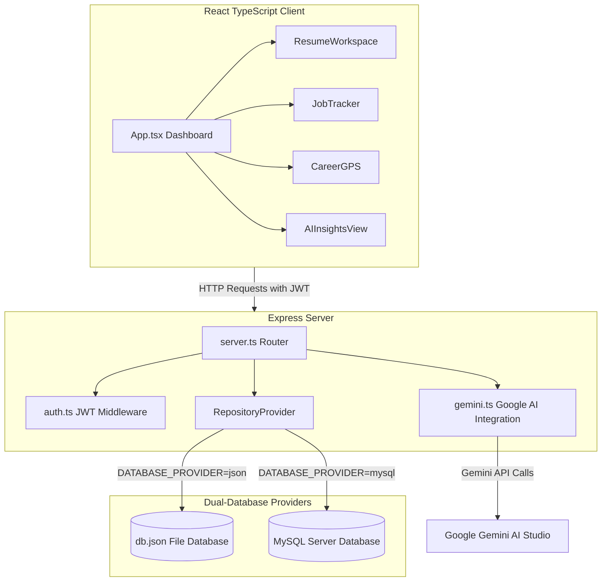

# 🚀 Gowtham CareerPilot AI

A comprehensive, production-ready full-stack career platform designed to empower job seekers. Gowtham CareerPilot AI integrates advanced **Google Gemini AI** models to automate resume optimization, track job applications, build personalized skill roadmaps, and forecast career trajectory metrics.

<div align="center">
  
</div>

<br />

<div align="center">

[](https://react.dev)
[](https://www.typescriptlang.org)
[](https://tailwindcss.com)
[](https://expressjs.com)
[](https://ai.google.dev)
[](https://www.mysql.com)

</div>

---

## 🌟 Key Features

### 1. 📊 Interactive Analytics Dashboard Overview
* **Application Funnel Tracking:** Visual metrics of total applied, interviewed, offered, and rejected positions.
* **Smart To-Do Recommendations:** Dynamic notifications highlighting upcoming interviews and recommended follow-up actions.
* **Success Probability Rate:** Visual progress widgets summarizing job-hunting efficiency.

### 2. 💼 Smart Job Application Tracker
* **Pipeline CRUD Operations:** Create, retrieve, update, and delete individual job applications.
* **Detailed Logs:** Track company name, target role, applied date, location, current application status, salary range, job descriptions, and custom follow-up notes.
* **Clean Table Grid UI:** Sortable and filterable layout for easy navigation.

### 3. 📄 SaaS Resume Studio & ATS Auditor
* **AI PDF Parser (OCR):** Upload raw PDF files and extract clean text automatically using Gemini's parser.
* **ATS Compatibility Matcher:** Copy-paste a target Job Description (JD) to get an ATS compatibility score, identify keyword gaps, and receive suggestions for improvement.
* **Action-Verb Bullet Optimizer:** Refine weak resume points instantly into high-impact statements using the **Action-Verb + Task + Result** framework.
* **Resume Generation from Scratch:** Interactively build structured resume JSON templates through step-by-step AI queries.

### 4. 🗺️ Career GPS (Learning Roadmap Generator)
* **Custom Learning Curriculums:** Enter your current skill set and target job role to generate step-by-step learning milestones.
* **Actionable Milestones:** Every phase includes core concepts, suggested online resources, certifications, and realistic timelines.
* **Saved Progress:** Save multiple career pathways and revisit them anytime from your workspace database.

### 5. 🧠 Copilot AI Insights & Career Forecaster
* **Salary Expectations:** AI-modeled salary distribution for specific target roles.
* **Market Demand Trends:** Analyze whether a role has low, medium, or high industry demand.
* **Gemini Callback Forecasts:** AI-generated estimates of call-back rates based on matching skills, experience levels, and application tracking history.

---

## 🛠️ Technical Architecture

The project features a decoupled backend API architecture with a flexible data layer that can switch between file system mocks and persistent production databases.



### Technical Stack Details
* **Frontend:** React 19, TypeScript, Vite, Tailwind CSS v4, Motion (Framer Motion), Lucide React (icons).
* **Backend:** Express, Node.js, TSX (ESM run execution), ESBuild (server bundler).
* **Database:** Dual layer supporting JSON file-system mock database (`db.json`) or full relational database (`MySQL`).
* **Authentication:** Stateless JSON Web Token (JWT) with hashed passwords.

---

## 🚀 Local Development Setup

### Prerequisites
* **Node.js** (v18+ recommended)
* **MySQL Database** (Optional, only if running production environment provider)

### 1. Install Dependencies
Clone the repository and install all packages:
```bash
npm install
```

### 2. Configure Environment Variables
Create a file named `.env` or `.env.local` in the root directory:
```env
# Google Gemini API Key (Required)
GEMINI_API_KEY="your-gemini-api-key-here"

# Application URL
APP_URL="http://localhost:3000"

# Database Configuration (Defaults to 'json')
DATABASE_PROVIDER="json"

# JWT Secret Token (Any secure string)
JWT_SECRET="super-secret-jwt-key"

# MySQL Database Details (Only needed if DATABASE_PROVIDER="mysql")
MYSQL_HOST="localhost"
MYSQL_PORT="3306"
MYSQL_USER="root"
MYSQL_PASSWORD="your-mysql-password"
MYSQL_DATABASE="careerpilot"
```

### 3. Database Selection & Migrations
The application can run in three modes:

#### Mode A: JSON Database (Default, zero-config)
No extra setup required. The application automatically creates and updates a local `db.json` file in the project root.

#### Mode B: MySQL Database
1. Set `DATABASE_PROVIDER="mysql"` in your `.env`.
2. Run the database migration script to automatically build tables, structure relationships, and seed existing mock data from `db.json`:
   ```bash
   npm run migrate
   ```

#### Mode C: Serverless Vercel Deployment (Auto-detected)
When deployed on **Vercel**, the application automatically switches to serverless mode:
* Filesystem writes are redirected to `/tmp/db.json` (Vercel's ephemeral writable folder) and seeded automatically from your template to prevent read-only `EROFS` crashes.
* API requests are handled by serverless endpoints configured in [vercel.json](vercel.json).
* For persistent database storage in production on Vercel, it is recommended to set `DATABASE_PROVIDER="mysql"` and hook up a remote cloud database (e.g., Aiven, PlanetScale, Supabase, etc.).

### 4. Start the Application
Run the Vite and Express development environment in parallel:
```bash
npm run dev
```
Open your browser and navigate to `http://localhost:3000`.

---

## 📦 Directory Structure

```text
gowtham-careerpilot-ai/
├── assets/                  # Images and GIF demonstrations
├── scripts/                 # Automation and database migrations
│   └── migrate-db.ts
├── server/                  # Backend Express Server
│   ├── repositories/        # Database Access Objects (DAOs)
│   │   ├── json/            # JSON file-system handlers
│   │   └── mysql/           # Relational SQL handlers
│   ├── auth.ts              # JWT authentication logic
│   ├── db.ts                # Database connection utilities
│   └── gemini.ts            # Google Gemini AI services wrapper
├── src/                     # React Frontend Application
│   ├── components/          # Reusable UI features
│   │   ├── AIInsightsView.tsx
│   │   ├── AnalyticsDashboard.tsx
│   │   ├── AuthForm.tsx
│   │   ├── CareerGPS.tsx
│   │   ├── JobTracker.tsx
│   │   └── ResumeWorkspace.tsx
│   ├── lib/                 # Core API connectors
│   ├── types.ts             # TypeScript definitions
│   ├── index.css            # Stylesheets
│   └── main.tsx             # Application entrypoint
├── package.json             # Build configurations & dependencies
├── server.ts                # Server startup
└── vite.config.ts           # Vite Bundler configurations
```

---

## 🛡️ License

Distributed under the MIT License. See [LICENSE](LICENSE) for more details.

---

<div align="center">
  Developed by <a href="https://github.com/GowthamCodeBase">Gowtham</a> with ❤️
</div>
